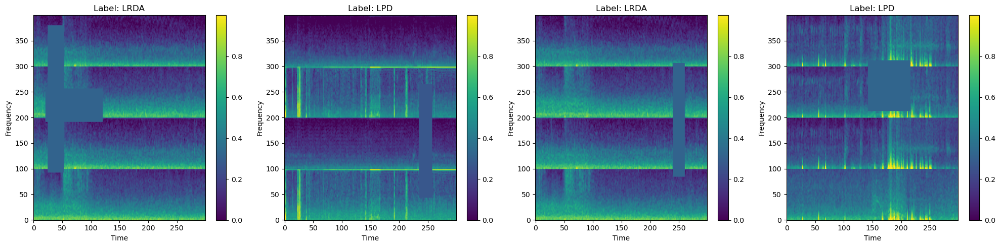

# EEG Harmful Brain Activity Classification - With 1D, 2D ConvNets



## Index

- [Description](#description)
- [Setup](#setup)
- [Research Notes & Though Process](./research.md)

## Description

This repository contains utilities, custom DataSet and DataLoader classes, notebooks, and other tools developed for harmful brain activity classification using data from the HMS Kaggle competition. Currently, the model achieves state-of-the-art performance, with a KLDivLoss per example of 0.27.

I am also logging the lessons I've learned throughout this project.

## What's Next?

For the 2D model, I’m exploring other signal processing augmentation techniques, such as focusing on the middle 10 seconds of the spectrogram, inspired by [this Kaggle post](https://www.kaggle.com/competitions/hms-harmful-brain-activity-classification/discussion/472976).

I’m also exploring the theory behind time series data classification using 1D convolutions and plan to develop a 1D ConvNet.

Finally, I plan to deploy this on my personal website to gain experience designing user-friendly UI/UX for AI interfaces (coming soon).

## Setup

This project uses conda environments.

Clone the repo:

```bash
git clone https://github.com/sumkawa/icu-lstm.git
cd icu-lstm
```

Install dependencies, required packages, and setup conda development environment:

```bash
make install
```

Get data from kaggle competition:

```bash
kaggle competitions download -c hms-harmful-brain-activity-classification -p ./data
```

Activate the conda environment:

```bash
conda activate icu_classifier_env
```

### Converting .parquet to .npy, visualize initial data

Give proper user permissions:

```bash
chmod +x visualize.py parq_to_npy.py
```

Seed database by converting parquet to npy for more efficient data loading and model compatibility (this step is only necessary if training with efficient net - mixnet implementations convert raw EEG data on the fly):

```bash
python parq_to_npy.py
```

(Optional) Visualize data with matplotlib:

```bash
python visualize.py
```
